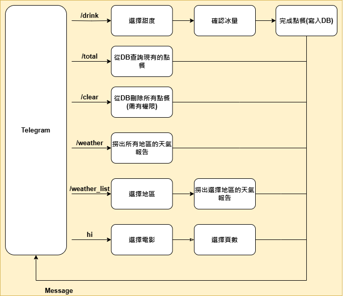
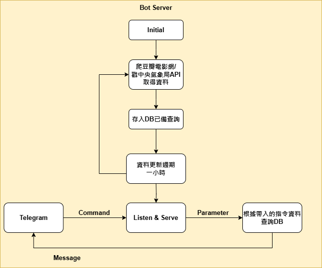

# MyGoTGBot

一個使用 Go 語言開發的 Telegram 機器人。

## 功能特點

### 1. 互動式機器人功能

| 指令 | 功能描述 | 流程 |
|------|----------|------|
| /drink | 飲料點餐系統 | 選擇甜度 → 確認冰量 → 完成點餐(寫入DB) |
| /total | 從DB查詢現有的點餐 | 直接顯示結果 |
| /clear | 從DB刪除所有點餐(需有權限) | 直接執行刪除操作 |
| /weather | 顯示所有地區的天氣報告 | 直接顯示結果 |
| /weather_list | 地區天氣查詢 | 選擇地區 → 顯示該地區天氣報告 |
| hi | 互動式問候 | 選擇表情 → 選擇貼圖 → 回應用戶 |



### 2. 網路爬蟲功能

- 自動抓取豆瓣電影 Top 250 資訊
- 整合中央氣象局API獲取天氣資料
- 資料定期更新（每小時一次）
- 資料存儲至MongoDB數據庫



### 3. 簡單會員系統

- 需配合 [myGoMemberServer](https://github.com/Anla3421/myGoMemberServer) 使用
- 用戶註冊與管理
- 權限控制（部分功能僅限管理員使用）

### 4. 天氣資訊服務

- 整合國土測繪中心天氣資訊
- 支持全台各地區天氣查詢
- 自動更新天氣數據
- 即時天氣查詢（目前此功能正在維護中）

## 系統需求

- Go 1.16+
- MongoDB
- Docker (可選)

## 安裝與配置

### 1. 克隆項目

```bash
git clone https://github.com/Anla3421/myGoTGBot.git
cd myGoTGBot
```

### 2. 使用Docker環境（推薦）

```bash
bash ./infrastructure/docker/go.sh
```

### 3. 配置文件

在專案根目錄創建 `config.json` 文件，包含以下配置：

```json
{
    "BotToken": "你的Telegram機器人Token",
    "OwnerID": 你的Telegram用戶ID(整數),
    "GroupID": 你的群組ID(整數),
    "WeatherToken": "你的國土測繪中心Token",
    "movieMaxPage": 10
}
```

### 4. 啟動服務

```bash
go run main.go
```

## 使用方法

1. 在Telegram中搜索你的機器人名稱
2. 開始對話並發送指令（如 `/drink`、`/weather` 等）
3. 根據機器人提示進行互動

## 開發與擴展

### 項目結構

```
myGoTGBot/
├── config/         # 配置文件處理
├── controllers/    # 控制器邏輯
├── models/         # 數據模型
├── services/       # 業務邏輯
├── infrastructure/ # 基礎設施（Docker等）
├── utils/          # 工具函數
└── main.go         # 入口文件
```

### 添加新功能

1. 在 `controllers` 目錄中創建新的控制器
2. 在 `services` 目錄中實現業務邏輯
3. 在主程序中註冊新的命令處理器
